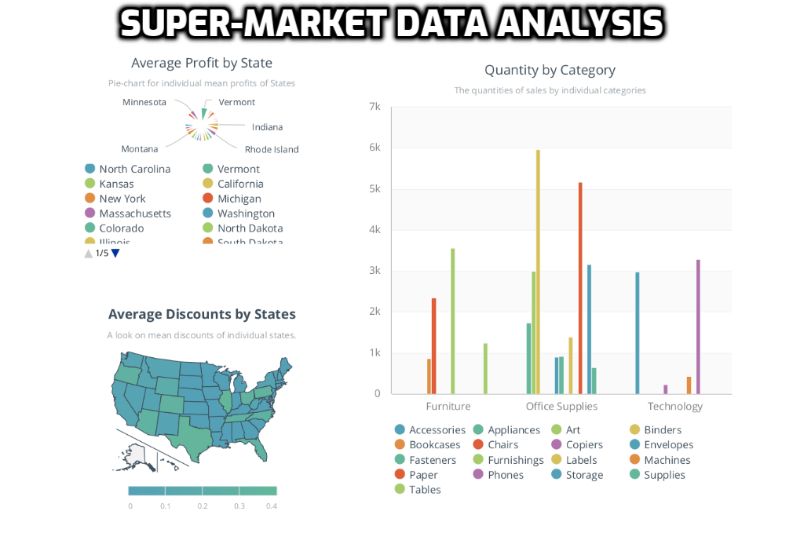
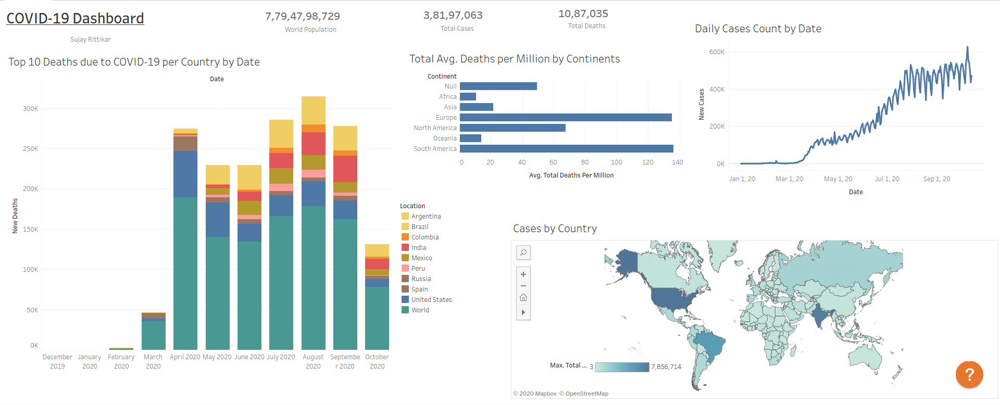

# TSF
The Sparks Foundation Internship Problems:

1] Prediction using Supervised ML: 
Predict the percentage of marks of an student based on the number of
study hours.

2] Prediction using Unsupervised ML: 
From the given ‘Iris’ dataset, predict the optimum number of clusters and
represent it visually.

3] Prediction using Decision Tree Algorithm: 
For the given ‘Iris’ dataset, create the Decision Tree classifier and visualize it
graphically.

4] Stock Market Prediction using Numerical and Textual Analysis:
Create a hybrid model for stock price/performance prediction using
numerical analysis of historical stock prices, and sentimental analysis
of news headlines.

5] To Explore Business Analytics:
Perform ‘Exploratory Data Analysis’ on the provided dataset ‘SampleSuperstore’.
Create storyboards.

Format: 

6] Create a dashboard showing spread of Covid-19 cases in your country or any
region:

Format: 

Link to the Dashboard: https://prod-apnortheast-a.online.tableau.com/#/site/sujayrittikar/workbooks/90945?:origin=card_share_link
